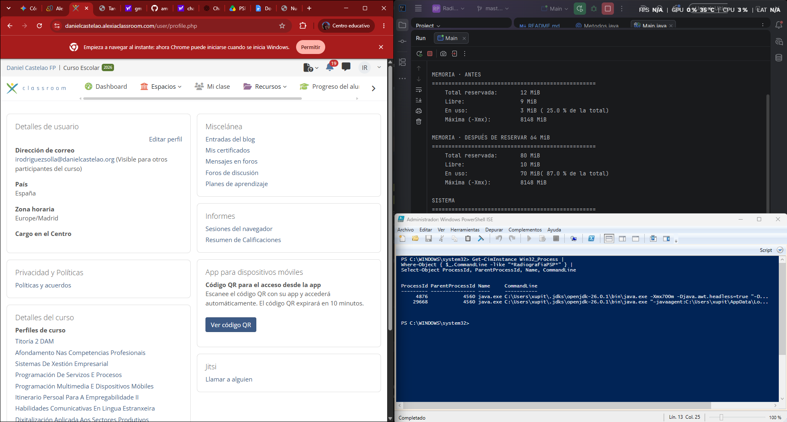
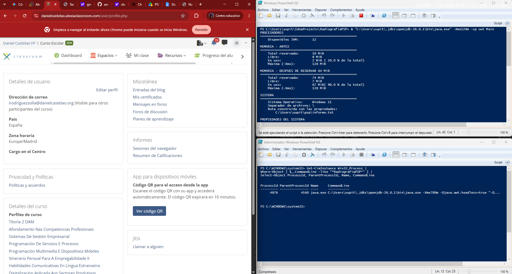
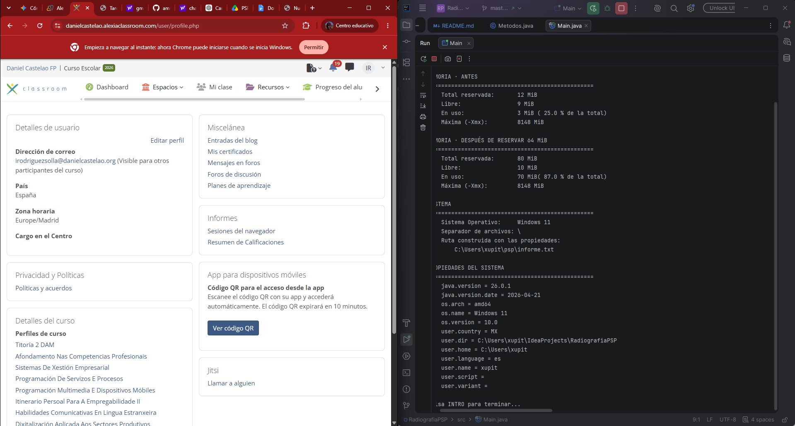
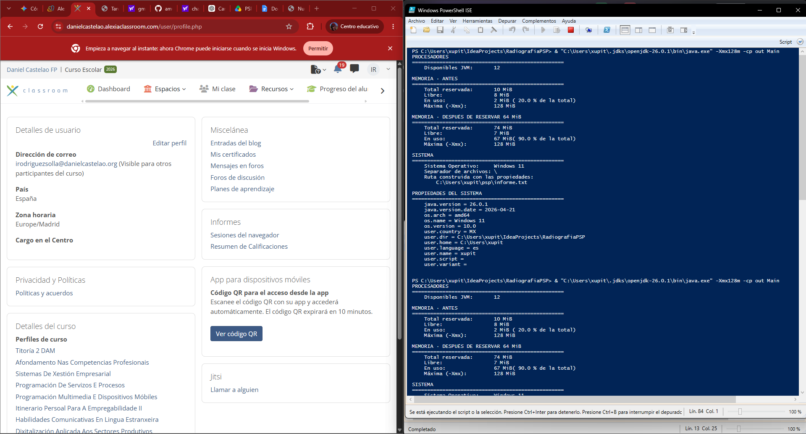

# Parte2
##  PID y  PPID
### Programa lanzado desde IDE

- PID: 4876
- PPID: 4560
- Se identifica mediante el campo PPID (Parent Process ID), que señala al proceso ejecutor que generó al proceso actual (PID). Por diseño en el sistema operativo, un proceso hijo siempre nace a partir de una llamada emitida por su proceso padre.

Para sacar por windows el comando que me saca PID y el PPID le pregunte a geminis ( pasarme el comando ps -ef | grep InformeSistema para windows)

### Programa lanzado desde Terminal

- PID: 4876
- PPID: 4560

Para ejecutarlo en Windows, le pedí a Gemini que me dijera el comando. (Pasame el comando de compilación y de ejecución en windows usado el ejecutor de IntelliJ)

### ¿Por qué no cambia el PPID?

En mi caso el PPID no cambia y se mantiene siempre en **4560**. Esto ocurre porque no estoy lanzando el programa compilando y ejecutando directamente desde la terminal con el JDK a mano, sino que lo estoy haciendo a través del botón de **Run de IntelliJ**.

Al usar el ejecutor de IntelliJ, el propio IDE crea y mantiene un proceso entorno ("runner") que actúa como el padre de mi programa. Como IntelliJ se queda abierto y ejecutando el proceso en todo momento, ese proceso padre (PID 4560) nunca se cierra ni muere. Al estar el padre siempre activo, el valor del PPID no tiene ninguna razón para cambiar durante la prueba.

## Comparación las cuatro cifras de memoria

#### Ejecución de en IntelliJ

#### Ejecución de en Terminal

- Máxima (-Xmx): Cambia. En la ejecución normal por defecto tiene un límite de 8148 MiB, mientras que en la consola se reduce a 128 MiB debido a que se le aplicó la regla -Xmx128m.
- Total reservada: Cambia. En la ejecución normal pasa de 12 MiB a 80 MiB, mientras que con el límite pasa de 10 MiB a 74 MiB. Esto ocurre porque al tener un tope de memoria más bajo, el Entorno de Ejecución de Java pide bloques de memoria iniciales un poco más pequeños al sistema operativo.
- En uso: Prácticamente no cambia. Pasa de 70 MiB a 67 MiB. El programa realiza exactamente la misma tarea reservar 64 MiB de datos, por lo que el consumo de memoria real que necesita el código es casi el mismo.
- Libre: Prácticamente no cambia. Se mantiene alrededor de los 7-10 MiB en ambos casos. Esta cifra solo indica la memoria que el Entorno de Ejecución de Java ya le pidió al sistema pero que todavía no ha gastado.

## Multiplataforma
### Indica qué ruta genera vuestro programa en el apartado multiplataforma y qué ruta generaría en el otro sistema operativo.
En mi caso, en Windows la ruta generada es: C:\Users\xupit\psp\informe.txt
En Linux / macOS, la ruta generada sería: /home/xupit/psp/informe.txt

### ¿Por qué cambia?

- Separadores de carpetas: Windows utiliza la barra invertida (\), mientras que Linux y macOS usan la barra diagonal (/).
- Ruta de usuario: Windows empieza en la unidad de disco (C:\Users\...) y Linux en la raíz de usuarios (/home/...).